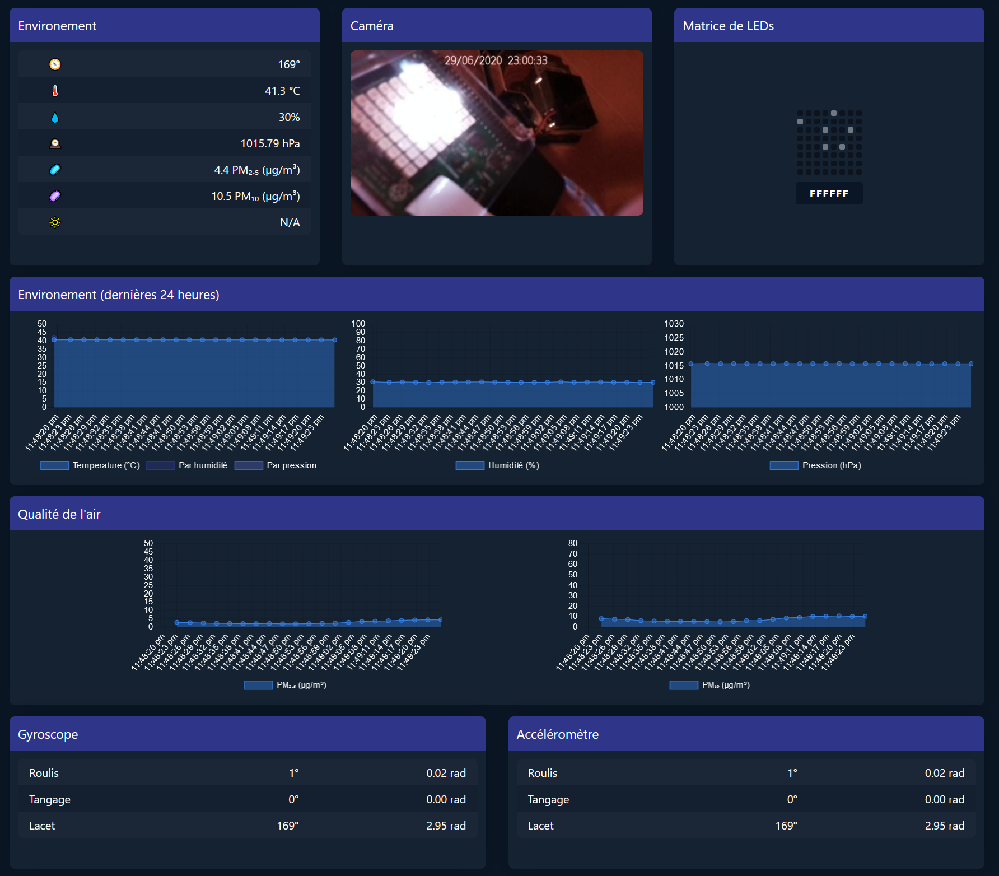

# 🌏 Terraformer

This is a web control panel for Raspberry PI sensors :
* ⛅ Sense HAT
* 🦠 SDS011 Air Monitoring
* 📷 Raspberry PI Camera (requires [RPi Cam Web Interface](https://elinux.org/RPi-Cam-Web-Interface) setup)



# Usage

## Installation
```
git clone https://github.com/lowlighter/terraformer.git
npm install
```

## Usage
```
sudo npm start -- --verbose --port 3000 --sensors sensehat,sds011 --camera username:password@rpi.cam.web.server:port
```
